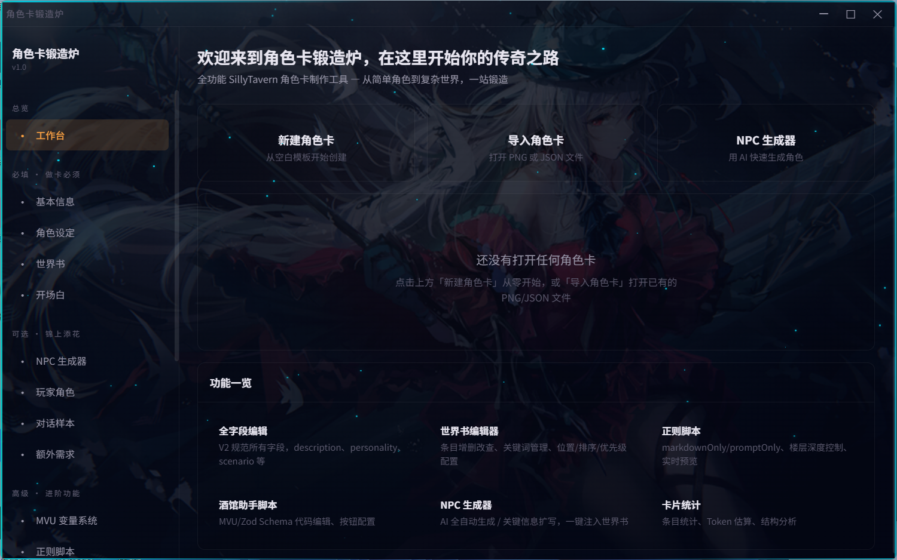

# CardBuilding

> Công cụ tạo thẻ nhân vật dành cho SillyTavern —— Bàn làm việc thanh trạng thái + Tạo thẻ có cấu trúc + Hỗ trợ AI, ứng dụng desktop tiếng Việt dựa trên Electron.



## Về dự án này

CardBuilding được tái cấu trúc dựa trên mã nguồn của [Anastasia2372/sillytavern-cardforge](https://github.com/Anastasia2372/sillytavern-cardforge) v7.6.0, kế thừa các khả năng tạo thẻ hoàn thiện (Thông tin cơ bản, Worldbook, Hệ thống biến MVU, Script Regex, Script Tavern Helper, Mẫu EJS, Đóng gói PNG, Hỗ trợ AI tạo...), đồng thời thiết kế lại toàn bộ luồng làm việc và trải nghiệm giao diện. Xin chân thành cảm ơn tác giả dự án gốc đã mở mã nguồn.

Dự án này được phát hành theo giấy phép **GPL-3.0-or-later**, thông tin bản quyền và giấy phép xem tại [LICENSE](./LICENSE).

## Tính năng cốt lõi

### Bàn làm việc thanh trạng thái (Thay đổi lớn nhất so với bản gốc)

Bản CardForge gốc khi làm một thẻ có thanh trạng thái phải chuyển đổi qua lại giữa 3 trang "Hệ thống biến MVU / Thanh trạng thái frontend / Sandbox thanh trạng thái"; CardBuilding đã tích hợp toàn bộ quy trình vào **Bàn làm việc 3 cột trên một trang đơn**:

- **Cột trái · Kho biến** —— Quản lý biến dạng thẻ theo nhóm, 6 preset nhanh (RPG / Tu tiên / Học đường / Mô phỏng / Hẹn hò / Sinh tồn) + Lưu trữ preset tùy chỉnh, sắp xếp kéo thả nhóm và biến.
- **Cột giữa · Chỉnh sửa** —— Biểu mẫu biến có kiểu dữ liệu (Số / Văn bản / Boolean / Enum / Record / Mảng, gồm phạm vi, kẹp giá trị, căn cứ cập nhật), cấu hình tiêm toàn cục, kiểm tra hợp lệ thời gian thực ở đầu trang (chặn tiêm nếu có lỗi).
- **Cột phải · Xem trước + AI** —— Xem trước thời gian thực chính là kết quả cuối cùng (5 chủ đề × 3 bố cục), đổi cấu hình sẽ làm mới ngay lập tức; Khu vực thử nghiệm biến sửa giá trị thủ công xem phản hồi giao diện, hỗ trợ ảnh chụp ngữ cảnh (kiểm tra chuyển đổi trạng thái đầy máu / cạn máu); 3 lối vào AI: Thiết kế phương án biến / Tạo trọn bộ 1 chạm / AI làm đẹp HTML.

Bộ MVU (2 script + mục Worldbook + 4 Regex + placeholder lời mở đầu) và mã HTML thanh trạng thái được sinh ra từ lớp biên dịch tự động: Hiện danh sách xem trước trước khi tiêm, hỗ trợ 2 chiến lược thay thế / gộp, đồng thời hỗ trợ gỡ bỏ bộ đã tiêm 1 chạm. Cung cấp thêm **Chế độ thuần văn bản** (AI xuất văn bản trạng thái ở mỗi lượt phản hồi, không cần MVU). 3 trang cũ đã được loại bỏ, Bàn làm việc là lối vào duy nhất cho thanh trạng thái.

### Biểu mẫu nhân vật có cấu trúc và Chế độ dự án

- Biểu mẫu có cấu trúc 5 nhóm cho nhân vật chính (Thân phận cơ bản / Nhận diện ngoại hình / Tính cách hành vi / Ngôn ngữ tương tác / Bối cảnh cốt truyện), tổng hợp thời gian thực thành mô tả hoàn chỉnh.
- Khóa trường AI (lockedFields): Bảo vệ các trường đã xác nhận khi AI áp dụng, áp dụng từng mục + xác nhận bản nháp trước khi ghi.
- Tạo bản nháp Worldbook 1 chạm từ hồ sơ nhân vật; nhận diện thông minh nhân vật và trích xuất có cấu trúc khi nhập thẻ nhân vật.
- **Chế độ đa dự án**: Tạo / chuyển đổi / lưu / xóa nhiều thẻ, lưu trữ snapshot hoàn chỉnh, không còn bị giới hạn chỉ chỉnh sửa 1 thẻ tại một thời điểm.

### Tầng dịch vụ AI

- Các yêu cầu được điều phối thống nhất tại tiến trình chính: Thời gian chờ mặc định 90 giây, thử lại theo lũy thừa lùi, hàng đợi tối đa 3 luồng đồng thời, có thể hủy cả khi đang chạy lẫn khi đang xếp hàng, bảng "Nhiệm vụ AI" trên thanh tiêu đề hỗ trợ dừng từng mục.
- API Key được lưu trữ mã hóa qua Electron safeStorage (tự động chuyển đổi Key văn bản thuần cũ).
- Bảng thống kê sử dụng: Số lượt yêu cầu, số lượt thất bại, lượng token tiêu thụ, thời gian trung bình; ngân sách ngữ cảnh được phân bổ linh hoạt theo cửa sổ ngữ cảnh của mô hình.
- Phân tích dung sai thống nhất cho đầu ra của AI (Sửa lỗi JSON 6 cấp hạ cấp), phản hồi stream rõ ràng ngay cả khi mạng yếu.

### Giao diện thị giác êm dịu hơn

Loại bỏ hạt bụi sao, viền sáng lửa, hiệu ứng quét sáng nút bấm, giữ lại bầu không khí chủ đề tối màu; hình nền tích hợp mặc định tắt, có thể bật tắt tại thanh bên. Màu nhấn được xử lý giảm độ bão hòa, hỗ trợ hạ cấp `prefers-reduced-motion`.

## Cài đặt và sử dụng

### Tải bộ cài đặt (Khuyên dùng cho người dùng thông thường)

Tải xuống `CardBuilding-Setup-*.exe` (Windows x64) từ trang [Releases](https://github.com/77rickliu/CardBuilding/releases).

- Bộ cài đặt chưa ký chứng chỉ số, khi chạy lần đầu Windows SmartScreen có thể cảnh báo "Ứng dụng chưa được nhận diện", nhấp "More info → Run anyway" là được.
- Lưu ý về plugin phụ thuộc: Để dùng tính năng thanh trạng thái trong SillyTavern, bạn cần cài đặt sẵn các plugin "Tavern Helper", "Prompt Template", "MVU".

### Chạy từ mã nguồn (Dành cho lập trình viên)

```bash
git clone https://github.com/77rickliu/CardBuilding.git
cd CardBuilding
npm install --no-audit --no-fund
npm run electron:dev   # Chế độ phát triển desktop
npm run dist           # Đóng gói bộ cài đặt Windows NSIS
```

- Yêu cầu Node.js 18+
- Giao diện hoàn toàn bằng tiếng Việt
- Cập nhật tự động tạm thời chưa kết nối (sẽ khôi phục sau khi cấu hình nguồn phát hành mới)

## Cấu trúc dự án

```text
src/
  ├── main/        Tiến trình chính Electron (Cửa sổ, Điều phối AI, Đọc ghi file thẻ, Log)
  └── renderer/    Tiến trình kết xuất
        ├── views/       Giao diện trang (Bàn làm việc, Worldbook, Biểu mẫu nhân vật, NPC, Chẩn đoán, Cài đặt API...)
        ├── components/  Component (Modal xem trước tiêm, Log lỗi...)
        ├── stores/      Trạng thái Pinia (Dữ liệu thẻ, Cấu hình AI, Dự án...)
        └── utils/       Tiện ích (Lớp biên dịch thanh trạng thái, Ngữ cảnh AI, Sửa lỗi JSON, Chuẩn hóa...)
public/           Tài nguyên tĩnh (Icon, Mô hình Live2D)
scripts/          Script phát triển và kiểm thử (Smoke test bộ biên dịch thanh trạng thái, Test dịch vụ AI...)
docs/             Tài liệu và ảnh chụp màn hình
```

Xem tài liệu kỹ thuật chi tiết tại [PROJECT.md](./PROJECT.md), nhật ký thay đổi phiên bản tại [CHANGELOG.md](./CHANGELOG.md).

## Lời cảm ơn

- [Anastasia2372/sillytavern-cardforge](https://github.com/Anastasia2372/sillytavern-cardforge) —— Tiền thân và nền tảng của dự án này, cảm ơn tác giả gốc vì đã mở mã nguồn và thiết kế xuất sắc.
- [MagicalAstrogy/MagVarUpdate](https://github.com/MagicalAstrogy/MagVarUpdate) (MVU) và StageDog/tavern_resource —— Các component mã nguồn mở mà runtime thanh trạng thái phụ thuộc vào.

## Giấy phép

GPL-3.0-or-later, chi tiết xem tại [LICENSE](./LICENSE).